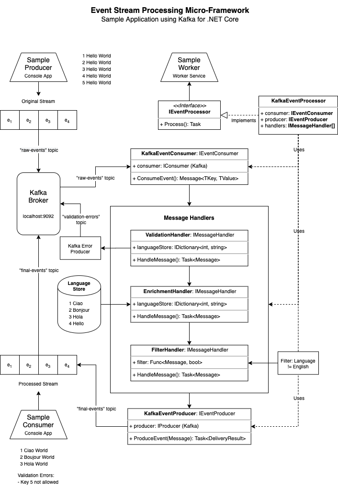

# Event Stream Processing Micro-Framework

Single event stream processing micro-framework for Apache Kafka using .NET Core

## Introduction

This framework provides a set of interfaces and abstract base classes for building an event stream processing pipeline. These are contained in the **EventStreamProcessing.Abstractions** package, are generic in nature, and are not tied to any one streaming platform, such as Apache Kafka. To use these abstractions simply create a class that extends `EventProcessor<TKey, TValue>` and supply the required consumers, producers and message handlers.

While the abstractions are not coupled to any streaming platform, the **EventStreamProcessing.Kafka** package provides an implementation that uses the **Confluent.Kafka** package to read and write event streams using Apache Kafka.

## Sample Description

The best way to become familiar with this framework is to examine the **EventStreamProcessing.Sample.Worker** project in the *samples* folder. You can use Docker to run a local instance of the Kafka broker, then run the sample worker, consumer and producer apps.

Here is a diagram depicting how an event stream is processed by the **Sample Worker** service to validate, enrich and filter messages before writing them back to Kafka.



1. The **Sample Producer** console app lets the user write a stream of events to the Kafka broker using the "raw-events" topic. The numeral represents the event key, and the text "Hello World" presents the event value.
2. The **Sample Worker** service injects an `IEventProcessor` into the `KafkaWorker` class constuctor. Then `ExecuteAsync` method calls `eventProcessor.Process` in a `while` loop until the operation is cancelled.
3. The `Program.CreateHostBuilder` method registers an `IEventProcessor` for dependency injection with a `KafkaEventProcessor` that uses `KafkaEventConsumer`, `KafkaEventProducer` and an array of `MessageHandler` with `ValidationHandler`, `EnrichmentHandler` and `FilterHandler`.
```csharp
// Add event processor
services.AddSingleton<IEventProcessor>(sp =>
{
    // Create logger, consumer, producers
    var logger = sp.GetRequiredService<ILogger>();
    var kafkaConsumer = KafkaUtils.CreateConsumer(
        consumerOptions.Brokers, consumerOptions.TopicsList,
        sp.GetRequiredService<ILogger>());
    var producerOptions = sp.GetRequiredService<ProducerOptions>();
    var kafkaErrorProducer = KafkaUtils.CreateProducer(
        producerOptions.Brokers, producerOptions.ValidationTopic,
        sp.GetRequiredService<ILogger>());
    var kafkaFinalProducer = KafkaUtils.CreateProducer(
        producerOptions.Brokers, producerOptions.FinalTopic,
        sp.GetRequiredService<ILogger>());

    // Create handlers
    var handlers = new List<MessageHandler>
    {
        new ValidationHandler(
            sp.GetRequiredService<IDictionary<int, string>>(),
            new KafkaEventProducer<int, string>(kafkaErrorProducer, producerOptions.ValidationTopic, logger),
            logger),
        new EnrichmentHandler(
            sp.GetRequiredService<IDictionary<int, string>>(), logger),
        new FilterHandler(
            m => !m.Value.Contains("Hello"), logger) // Filter out English greetings
    };

    // Create event processor
    return new KafkaEventProcessor<int, string, int, string>(
        new KafkaEventConsumer<int, string>(kafkaConsumer, logger),
        new KafkaEventProducer<int, string>(kafkaFinalProducer, producerOptions.FinalTopic, logger),
        handlers.ToArray());
});
```
4. The `KafkaEventConsumer` in **Sample Worker** subscribes to the "raw-events" topic of the Kafka broker running on `localhost:9092`. The message handlers validate, enrich and filter the events one at a time. If there are validation errors, those are written back to Kafka with a "validation-errors" topic. This takes place if the message key does not correlate to a key in the language store. The `EnrichmentHandler` looks up a translation for "Hello" in the language store and transforms the message with the selected translation. The `FilterHandler` accepts a lambda expression for filtering messages. In this case the English phrase "Hello" is filtered out. Lastly, the `KafkaEventProducer` writes processed events back to Kafka using the "final-events" topic.
5. The **Sample Consumer** console app reads the "validation-errors" and "final-events" topics, displaying them in the console.

## Running the Sample Locally

> **Note**: To run Kafka you will need to allocate 8 GB of memory to Docker Desktop.

1. Start up Kafka using the following command at the project root.
```
docker-compose up --build -d
```
   - Run `docker-compose ps` to verify Kafka services are up and running.
   - Open the control center at http://localhost:9021/
   - Wait until **controlcenter.cluster** is in a running state.
2. In a new terminal start the **Sample Worker** service.
```
cd samples/EventStreamProcessing.Sample.Worker
dotnet run
```
3. In a new terminal start the **Sample Consumer** app.
```
cd samples/EventStreamProcessing.Sample.Consumer
dotnet run
```
4. In a new terminal start the **Sample Producer** app.
```
cd samples/EventStreamProcessing.Sample.Producer
dotnet run
```
   - Enter `1 Hello World` and press Enter.

   - Observe output in the **Sample Consumer** app.

   - Enter additional messages in the **Sample Producer** app
```
> 2 Hello World
> 3 Hello World
> 4 Hello World
> 5 Hello World
```
   - Output should display processed events for 2 and 3.

   - Event 4 should be filtered out.
   - Event 5 will produce a validation error.
   - Observe logging performed by the **Sample Worker** service.
5. You can terminate the consumer, producer and worker processes by pressing `Ctrl+C`.
6. Terminate Kafka by entering `docker-compose down`.

## Running the Sample Worker using Docker

If you want to deploy your event processing application to a Cloud provider, such as Amazon ECS, you will want to run the **Sample Worker** service locally using Docker. Since it will need to be a part of the same network as Kafka, it's easiest to use **Docker Compose** for this. Just open a terminal at the **EventStreamProcessing.Sample.Worker** directory and run the following.
```
docker-compose up
```
